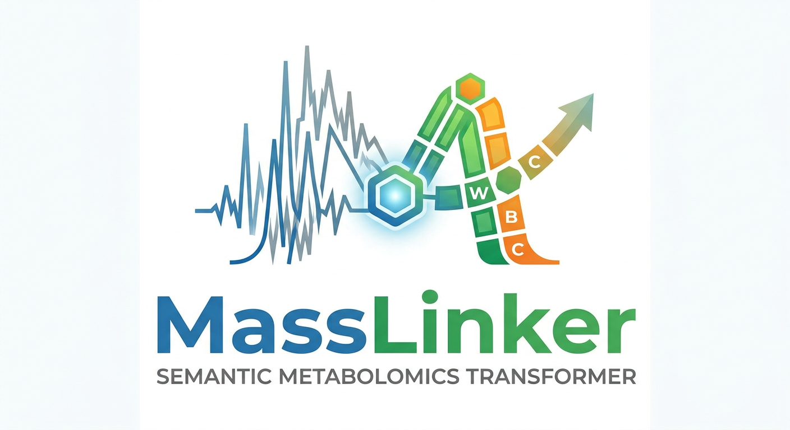

<h1 align="left">
  MassLinker
</h1>
<p align="center">
  
</p>

## About

**MassLinker Suite** is a cross-language computational framework for tokenizing raw liquid chromatography–mass spectrometry LC–MS metabolomics data into interpretable and machine-readable metabolic representations.

 
 
The framework implements **MassLinker encoding**, which fits MS1 chromatographic signals at specific m/z values using radial basis functions and extracts peak height, peak width, and peak position as chemically meaningful descriptors. These descriptors are concatenated into fixed-length metabolic tokens that preserve chromatographic signal intensity, peak morphology, and retention behavior.

Unlike conventional metabolomics workflows that compress raw LC–MS signals into metabolite abundance tables at an early stage, MassLinker retains signal-level structure before downstream interpretation. This enables richer representations for machine learning, Transformer-based classification, visualization, and SHAP-based model interpretation.

MassLinker Suite integrates R and Python modules into a standardized workflow. The R-based modules support feature extraction, RBF fitting, parameterization, and feature reorganization, while the Python-based modules support dataset construction, model training, statistical analysis, visualization, and interpretability analysis.

Overall, MassLinker Suite provides an end-to-end bridge between raw LC–MS measurements, interpretable metabolic tokens, and clinically relevant computational inference.

## Installation
MassLinker Suite contains both Python and R modules. We recommend using a clean conda environment for the Python components and a recent R installation for the R-based LC–MS preprocessing and MassLinker encoding steps.
[Quickly set up the dependent environment for MassLinker](./Installation.md)

## Quick Start

MassLinker Suite provides a minimal bash-based quick-start workflow that runs tokenization, dataset construction, and downstream differential analysis.

Before running the quick-start script, please prepare:

- mzML files in `./data/mzML`
- sample label file at `./data/target.xlsx`
- pathway annotation file at `./metadata/pathway_compound_detail.csv`

The `target.xlsx` file should contain at least three columns:

| filename | label | is_positive |
|---|---|---|
| sample_001 | control | 0 |
| sample_002 | disease | 1 |

Run the complete quick-start workflow:

```bash
bash quick_start.sh
```

# Test Data

Quick-start test data is available on Zenodo:

https://zenodo.org/records/20607249

The test data is derived from the positive ion mode of the MTBLS1122 dataset after MassLinker tokenization. It includes:

- `1122.joblib`: MassLinker-tokenized dataset in `ExcelDataset` format.
- `1122.xlsx`: Corresponding target/label file.
- 
## Tutorials

MassLinker Suite provides step-by-step tutorials for database preparation, signal encoding, model training, and downstream interpretation.

| Tutorial | Description |
|---|---|
| [KEGG pathway and metabolite database preparation](./Tutorials/prepare_metadata.md) | Prepare KEGG-based pathway, metabolite, exact mass, and reaction-link resources for downstream analysis. |
| [LC–MS data augmentation](./Tutorials/data_augmentation.md) | Generate augmented LC–MS files by perturbing m/z values, peak intensities, and retention times. |
| [Generating MassLinker metabolic tokens](./Tutorials/Encoding_ms1_data.md) | Convert raw or augmented LC–MS files into MassLinker metabolic tokens using pathway-guided m/z extraction and RBF fitting. |
| [Building PyTorch datasets from MassLinker metabolic tokens](./Tutorials/build_dataset.md) | Build single-cohort datasets from MassLinker token files and integrate multi-cohort datasets with polarity-aware correction. |
| [Utility functions for downstream analysis](./Tutorials/utils_overview.md) | Overview of utility functions for RBF reconstruction, token-distance analysis, enrichment analysis, visualization, and model-performance plotting. |
| [Small-sample statistical comparison using MassLinker tokens](./Tutorials/small_sample_comparison.md) | Compare two groups from one MassLinker dataset object using RBF-based token distances, statistical testing, peak visualization, and KEGG enrichment analysis. |
| [Machine-learning utilities overview](./Tutorials/ML_tools_overview.md) | Overview of tools for conventional ML training, cross-validation summaries, ROC visualization, and SHAP-based feature interpretation. |
| [Machine-learning validation examples](./Tutorials/ml_model_validation_examples.md) | Example workflows for fold-based ML validation, saved-model evaluation, external ROC comparison, and SHAP feature-importance analysis. |

## Transformer Classifier

In addition to the core tutorials, MassLinker Suite also provides advanced examples for optional modeling and benchmarking workflows.

These examples are not required for the basic MassLinker pipeline, but they can be useful for users who want to explore alternative downstream modeling strategies.

| Example | Description |
|---|---|
| [Transformer classifier training](./python/transformer.py) | Advanced example for training a Transformer-based classifier on MassLinker token tensors using augmented training samples, held-out test samples, and weighted focal loss. |
| [Transformer SHAP analysis](./Examples/transformer_shap_analysis.md) | Advanced example for interpreting trained Transformer classifiers with SHAP and visualizing class-specific MassLinker token importance. |


## Need help?
If you have any quesitions about MassLinkerSuite, please don't hesitate to email Tengfei Xu tfxu@zju.edu.cn.
Or if you are looking for prompt responses, you can feel free to add the work WeChat account of the first author Eason Wang (easonwang@zju.edu.cn).
<p align="center">
  
</p>

## License

This project is released for **academic and non-commercial use only**.

Commercial use, including use in commercial products, paid services, internal business operations, consulting, or revenue-generating activities, is not permitted without prior written permission from the copyright holder.

For details, please see the [LICENSE](./LICENSE) file.

For commercial licensing inquiries, please contact: easonwang@qq.com or tfxu@zju.edu.cn.
